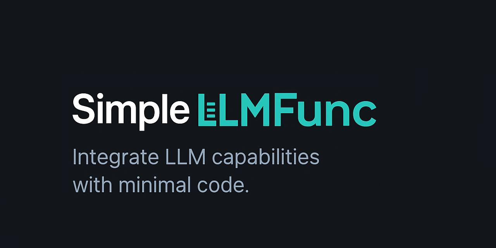

# SimpleLLMFunc



[](https://opensource.org/licenses/MIT)
[](https://www.python.org/)
[](https://github.com/NiJingzhe/SimpleLLMFunc/graphs/commit-activity)
[](https://makeapullrequest.com)

一个轻量级的LLM调用和工具集成框架，支持类型安全的LLM函数装饰器、多种模型接口和强大的日志跟踪系统。

## 特性

- **LLM函数装饰器**：简化LLM调用，支持类型安全的函数定义和返回值处理
- **多模型支持**：支持多种LLM提供商接口（目前支持智谱AI）
- **API密钥管理**：自动化API密钥负载均衡，优化资源利用
- **结构化输出**：使用Pydantic模型定义结构化返回类型
- **强大的日志系统**：支持trace_id跟踪和搜索，方便调试和监控
- **工具系统**：支持Agent与外部环境交互，易于扩展

## 项目结构

```
SimpleLLMFunc/
├── SimpleLLMFunc/            # 核心包
│   ├── interface/             # LLM 接口
│   │   ├── llm_interface.py   # LLM 接口抽象类
│   │   ├── key_pool.py        # API 密钥管理
│   │   └── zhipu.py           # 智谱 AI 接口实现
│   ├── llm_function/          # LLM函数装饰器
│   │   └── llm_function_decorator.py # 函数装饰器实现
│   ├── logger/                # 日志系统
│   │   ├── logger.py          # 日志核心实现
│   │   └── logger_config.py   # 日志配置
│   ├── tool/                  # 工具系统
│   │   ├── tool.py            # 工具抽象基类
│   │   └── schemas.py         # 工具参数模型
│   └── config.py              # 全局配置
└── examples/                  # 示例代码
    └── llm_function_example.py # LLM函数示例
```

## 配置管理

SimpleLLMFunc使用分层配置系统：

- 环境变量：最高优先级
- `.env` 文件：次优先级
- `config.py` 默认值：最低优先级

### 配置示例 (.env)

```
ZHIPU_API_KEYS=["your-api-key-1", "your-api-key-2"]
LOG_DIR=./
LOG_FILE=agent.log
LOG_LEVEL=DEBUG
```

## LLM函数装饰器

SimpleLLMFunc的核心特性是LLM函数装饰器，它允许您像使用普通函数一样使用LLM的能力：

```python
from typing import List
from pydantic import BaseModel, Field
from SimpleLLMFunc.llm_function import llm_function
from SimpleLLMFunc.interface import ZhipuAI_glm_4_flash_Interface

# 定义一个Pydantic模型作为返回类型
class ProductReview(BaseModel):
    rating: int = Field(..., description="产品评分，1-5分")
    pros: List[str] = Field(..., description="产品优点列表")
    cons: List[str] = Field(..., description="产品缺点列表")
    summary: str = Field(..., description="评价总结")

# 使用装饰器创建一个LLM函数
@llm_function(
    llm_interface=ZhipuAI_glm_4_flash_Interface,
    system_prompt="你是一个专业的产品评测专家，可以客观公正地评价各种产品。"
)
def analyze_product_review(product_name: str, review_text: str) -> ProductReview:
    """
    分析产品评论，提取关键信息并生成结构化评测报告
    
    Args:
        product_name: 产品名称
        review_text: 用户评论文本
        
    Returns:
        包含评分、优缺点和总结的产品评测报告
    """
    pass  # 函数体为空，实际执行由LLM完成

# 调用函数
result = analyze_product_review("XYZ无线耳机", "音质很好，但电池续航不佳...")
print(f"评分: {result.rating}/5")
```

### 装饰器特性

- **类型安全**：根据函数签名自动识别参数和返回类型
- **Pydantic集成**：支持Pydantic模型作为返回类型，确保结果符合预定义结构
- **提示词自动构建**：基于函数文档和类型标注自动构建提示词
- **系统提示分离**：将系统提示与用户输入分开，优化LLM的响应质量

## LLM接口

SimpleLLMFunc的LLM接口设计原则：

- 简单、无状态的函数调用
- 支持普通和流式两种调用模式
- API密钥负载均衡

### 示例用法

```python
from SimpleLLMFunc.interface import ZhipuAI_glm_4_flash_Interface

# 非流式调用
response = ZhipuAI_glm_4_flash_Interface.chat(
    trace_id="unique_trace_id",
    messages=[{"role": "user", "content": "你好"}]
)

# 流式调用
for chunk in ZhipuAI_glm_4_flash_Interface.chat_stream(
    trace_id="unique_trace_id",
    messages=[{"role": "user", "content": "你好"}]
):
    print(chunk)
```

## 日志系统

SimpleLLMFunc包含强大的日志系统，支持：

- 不同级别的日志（DEBUG, INFO, WARNING, ERROR, CRITICAL）
- 按trace_id跟踪和搜索相关日志
- 自动记录代码位置信息
- 彩色控制台输出
- JSON格式文件日志，便于解析

### 日志使用示例

```python
from SimpleLLMFunc.logger import app_log, push_error, search_logs_by_trace_id

# 记录信息日志
app_log("操作成功完成", trace_id="operation_123")

# 记录错误日志
push_error("操作失败", trace_id="operation_123", exc_info=True)

# 按trace_id搜索相关日志
logs = search_logs_by_trace_id("operation_123")
```

## 工具系统

SimpleLLMFunc实现了可扩展的工具系统，使LLM能够与外部环境交互：

### 核心概念

- **Tool**：表示LLM可以使用的一个能力或功能
- **ToolParameters**：工具参数的描述和验证模型
- **ParameterType**：参数类型枚举，支持基本类型和嵌套类型

### 工具定义示例

```python
from SimpleLLMFunc.tool import Tool, ToolParameters
from SimpleLLMFunc.tool.schemas import ParameterType

class WebSearchTool(Tool):
    def __init__(self):
        super().__init__(
            name="web_search",
            description="在互联网上搜索信息",
            parameters=[
                ToolParameters(
                    name="query",
                    description="搜索查询词",
                    type=ParameterType.STRING,
                    required=True,
                    example="最新的人工智能研究"
                ),
                ToolParameters(
                    name="max_results",
                    description="返回结果数量",
                    type=ParameterType.INTEGER,
                    required=False,
                    default=5,
                    example=10
                )
            ]
        )
    
    def run(self, query: str, max_results: int = 5):
        # 搜索逻辑实现
        return {"results": [...]}
```

### 与LLM函数集成

```python
@llm_function(
    llm_interface=ZhipuAI_glm_4_flash_Interface,
    tools=[WebSearchTool(), WeatherTool()],
    system_prompt="你是一个助手，可以使用工具来帮助用户。"
)
def answer_with_tools(question: str) -> str:
    """
    回答用户问题，必要时使用工具获取信息
    
    Args:
        question: 用户问题
        
    Returns:
        回答内容
    """
    pass
```

## API密钥管理

SimpleLLMFunc使用`APIKeyPool`类管理多个API密钥，实现负载均衡：

- 自动选择最少负载的API密钥
- 单例模式确保每个提供商只有一个密钥池
- 自动跟踪每个密钥的使用情况

## 安装和使用

1. 克隆此仓库
2. 创建`.env`文件并配置您的API密钥
3. 使用Poetry安装依赖：`poetry install`
4. 导入并使用SimpleLLMFunc的各个组件

## 许可证

MIT